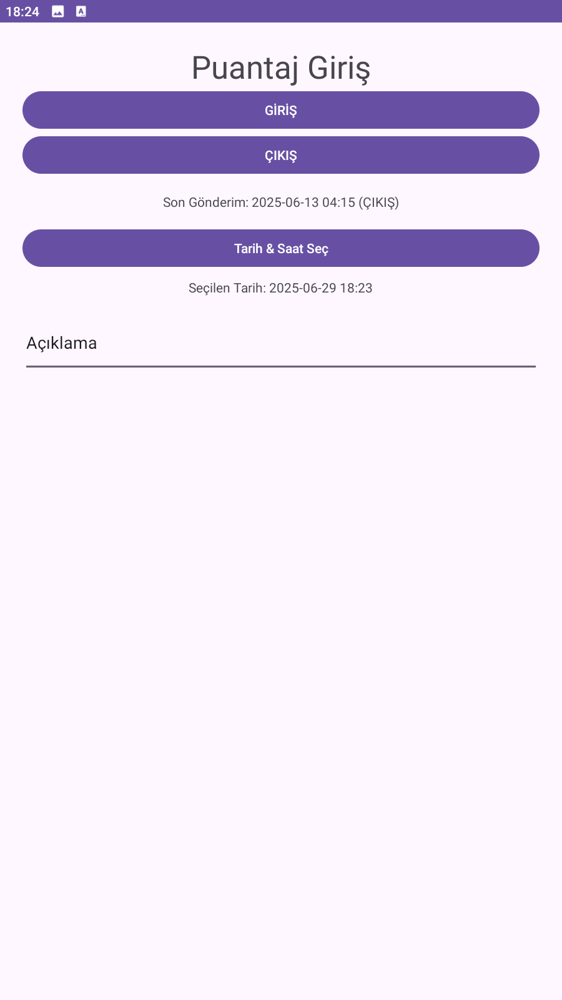
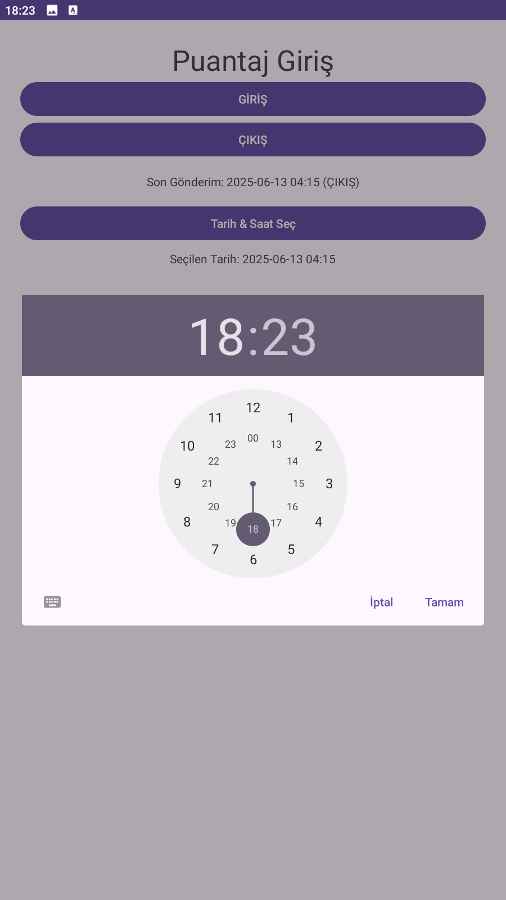

# 📱 PuantajGir - Android Personel Giriş/Çıkış Uygulaması

PuantajGir, personel giriş-çıkış saatlerini kolayca kaydeden hafif bir Android uygulamasıdır. Kayıtlar, Google Sheets üzerinden bir Google Apps Script Web App'e gönderilir.

---

## 🚀 Özellikler

- ✅ Personel ID ile kayıt
- 🕒 Giriş / Çıkış zamanı kaydı
- 🌐 Google Apps Script entegrasyonu (form post)
- 📅 Gönderim tarihi ve durumu gösterimi
- ✔️ Başarılı kayıt sonrası animasyonlu onay simgesi

---

## 🧩 Kullanılan Teknolojiler

- Android (Kotlin)
- OkHttp (veri gönderimi)
- Google Apps Script (backend)
- SharedPreferences (yerel ID saklama)

---

## 📂 Dosya Yapısı

| Dosya | Açıklama |
|-------|----------|
| `MainActivity.kt` | Uygulamanın ana mantığını barındırır (ID girişi, veri gönderimi, Toast mesajları vb.) |
| `activity_main.xml` | Giriş, çıkış, ID kaydetme ve onay simgesinin UI tasarımı |
| `strings.xml` | Uygulamadaki metinlerin merkezi tanımı |
| `AndroidManifest.xml` | Uygulama izinleri ve başlangıç aktivitesi tanımı |

---

## ⚙️ Kurulum

1. Android Studio ile projeyi açın.
2. `MainActivity.kt` içindeki `url` değişkenine kendi Web App URL’nizi girin.
3. APK'yı oluşturun ve cihazınıza yükleyin.

---

## 🔐 Uygulama Akışı

1. Kullanıcı ilk girişte **Personel ID**'sini girer ve kaydeder.
2. Uygulama, ID'yi `SharedPreferences` ile saklar ve ID giriş alanlarını gizler.
3. Kullanıcı **GİRİŞ** veya **ÇIKIŞ** butonuna tıkladığında, ID + tarih + durum bilgilerinden oluşan bir form Google Apps Script’e gönderilir.
4. Sunucu dönüş mesajı ekranda gösterilir ve onay simgesi kısa süreyle belirir.
5. Son gönderim tarihi ve durumu ekranda gösterilir.

---
## 📷 Ekran Görüntüleri

### Ana Ekran


### Tarih Seçimi


### Saat Seçimi


## 📤 Google Apps Script (Örnek Kod)

```javascript
function doPost(e) {
  var sheet = SpreadsheetApp.getActiveSpreadsheet().getSheetByName("PuantajKayıtları");
  var id = e.parameter.personelID;
  var tarih = e.parameter.tarih;
  var durum = e.parameter.durum;

  sheet.appendRow([id, tarih, durum]);

  return ContentService.createTextOutput("Kayıt başarıyla eklendi.");
}
